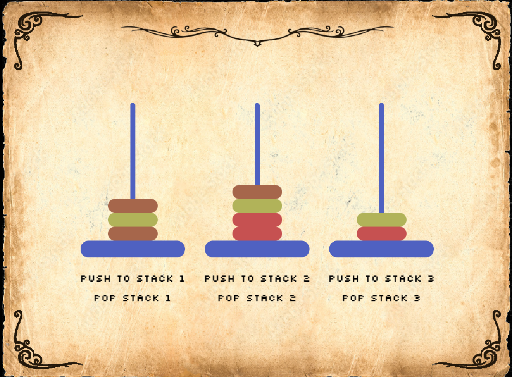

# Beneath MohenjoDaro
**A Lone Archaelogist's Expedition**

A 2D Top-Down RPG Game that tells the story of an archeologist who finds himself stranded in a much advanced and well-preserved structure which appears to be ruins of the Indus Civilization. 

Inspired by CodeCombat, this game employs an interactive gameplay and puzzles of varying difficulty to make learning DSA concepts fun.


## Features

- A proper GridPhysics Engine which works with Tiled JSONs for detecting collision and interacting with items.
- Lore about the structure and the fictionalized version of Indus Civilization that you can learn by progressing through the game.
- Puzzles that employs DSA concepts that you have to solve to get various artifacts, powerups and items.
- A Training Room which is a DSA visualizer which shows pseudocode and effect of various statements clearly
- Inventory to keep track of the items and weapons you earn through solving the puzzles
- Map screen which shows the rooms you have unlocked and your current location. Also allows you to teleport if you have the item **Rudraksha Bracelet**
- A Block Coding interface for solving the puzzles 


## Running and Deployment

Install necessary repos with npm

```bash
  npm install
```

To run this project, run

```bash
  npm run dev
```
To build this project, run

```bash
  npm run build
```
Your code will be built into a single bundle and saved to the `dist` folder, along with any other assets your project imported, or stored in the public assets folder.

In order to deploy your game, you will need to upload *all* of the contents of the `dist` folder to a public facing web server.
To deploy this project run


## Screenshots





## Tools used
- [Phaser JS Framework](https://phaser.io/)
- [TILED Map Editor](https://www.mapeditor.org/)
- [Aseprite](https://www.aseprite.org/)


## Acknowledgements

 - [Phaser V3 Examples](https://phaser.io/examples/v3)
 - [Itch.io Game Assets](https://itch.io/game-assets/free/)

